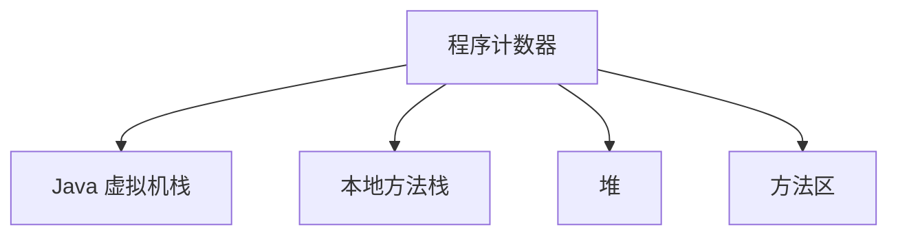

# Week 01 - JVM 内存结构概览

## 📌 任务目标

理解 JVM 在运行 Java 程序时的内存结构划分，掌握各区域的职责和特点，为后续性能优化和故障排查打下基础。

---

## 📚 学习资料

### 官方文档与博客：

- [Java 内存模型详解（阿里巴巴技术）](https://developer.aliyun.com/article/783606)
- [JVM 内存结构详解（图文）](https://www.cnblogs.com/ityouknow/p/12872845.html)

### 视频推荐：

- [B站：JVM 内存结构讲解（极客时间精选）](https://www.bilibili.com/video/BV1Xv411c7RN/)
- [YouTube：Java Memory Structure Explained](https://www.youtube.com/watch?v=Ej_02ICOIgs)（如可访问）

---

## 🧠 我的笔记总结

- JVM 内存结构整体图示（可手绘或引用图片）：
- 

方法区 | 堆内存 | 虚拟机栈 | 本地方法栈 | 程序计数器

- 每个区域的职责描述（每个点写 3~5 行文字）：
  - **方法区：** 在类加载后，存放类元信息，包括类名、方法、字段、常量、静态变量、接口；除此之外运行时常量池、字符串常量池（jdk1.7版本之前）
  - **堆（Heap）：** 堆是垃圾收集器管理的主要区域，所有对象实例和数组都在堆中分配
  - **虚拟机栈：** 为每个线程开辟私有空间，方法调用时会开辟一个栈帧，栈帧包含局部变量表、操作数栈、动态链接、方法返回地址
  - **本地方法栈：** 为虚拟机使用到的本地方法服务，类似于 Java 虚拟机栈
  - **程序计数器：**说明它是线程私有的，主要用于记录当前线程所执行的字节码的地址，是实现代码循环、分支、跳跃等的基础

---

## 📌 关键概念

请补充以下术语的解释（不少于 5 条）：

| 概念术语         | 我的理解                                       |
|------------------|------------------------------------------------|
| JVM              | java字节码运行的平台，java代码经过编译后运行在此平台                                             |
| 方法区（MetaSpace） |  存储类加载后的元信息，方法区还存放当着运行时常量池、字符串常量池，其中运行时常量池中有string符号引用，该引用指向字符串常量池的对象                                              |
| Java 栈（栈帧）     |   线程私有，用于每个线程执行代码方法时所需要的内存空间                                             |
| 堆内存（对象内存） |     存放对象实例，jdk1.8以后 字符串常量池也存放在堆中                                           |
| GC Root          |    垃圾回收机制的根节点                                            |
|运行时常量池	|存放编译期生成的各种字面量和符号引用，属于方法区的一部分|

---

## 🧪 自我提问（模拟面试）

1. JVM 中的栈和堆分别用来做什么？堆用来存对象实例，栈提供每个线程执行代码所需的内存空间
2. 为什么要将方法区与堆分离？将对象分配与类对象元数据信息隔离开来
3. 什么情况下会出现 `StackOverflowError`？ 栈中没有足够多的空间用于新的栈帧创建，如无止境的递归方法调用
4. JVM 中的哪些区域是线程隔离的？程序计数器、本地方法栈、虚拟机栈是线程私有的

---

## ⏳ 学习时间记录

| 日期       | 时长 | 内容                         |
|------------|------|------------------------------|
| 2025-06-03 | 1h   | 阅读资料 + 初步理解内存结构   |
| 2025-06-04 | 1.5h | 观看视频，补全笔记结构       |
| ...        | ...  | ...                          |

---

## ✅ 本任务完成情况（打勾）

- [ ] 学习资料已阅读 ✅
- [ ] 视频已观看 ✅
- [ ] 每个内存区域总结 ✅
- [ ] 表格补全 ✅
- [ ] 自我提问 ✅

